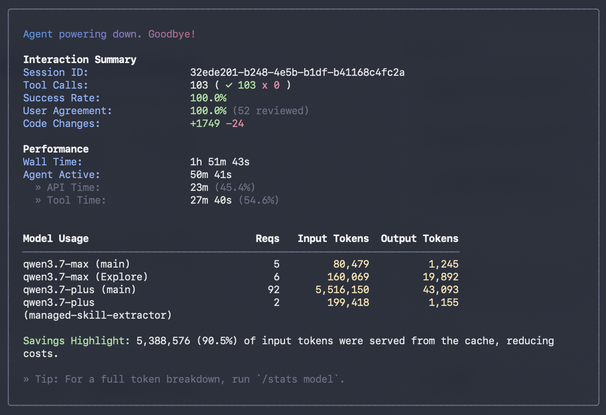
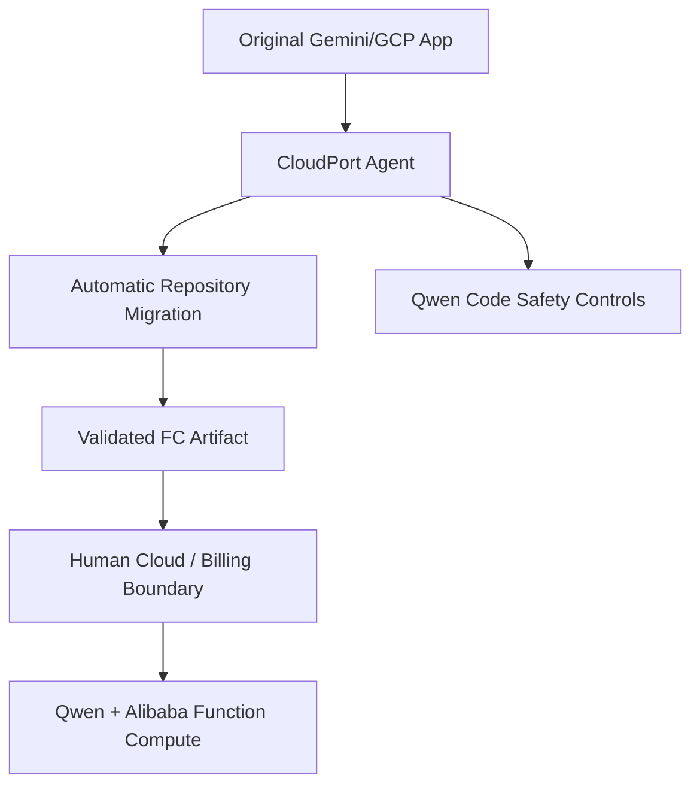
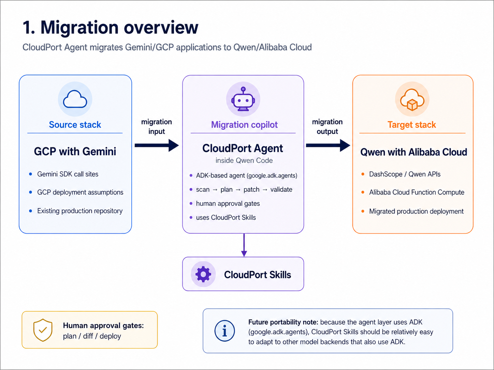
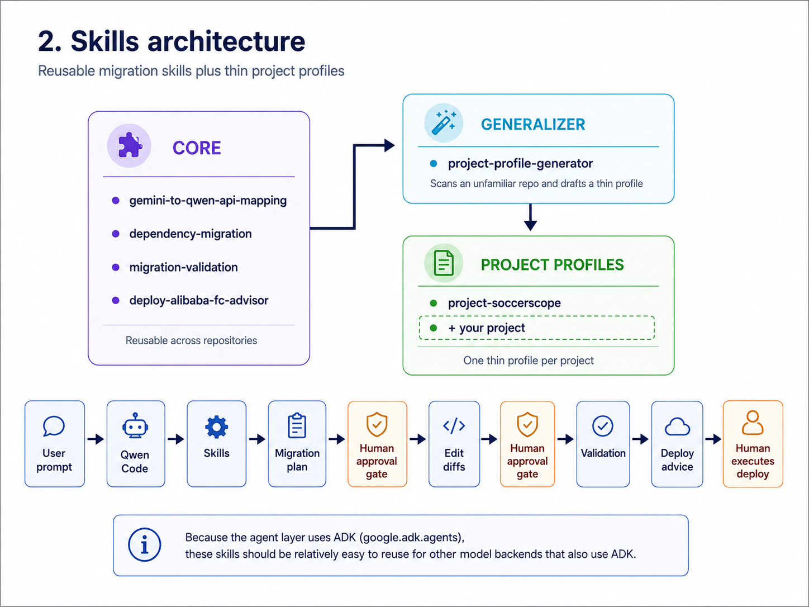
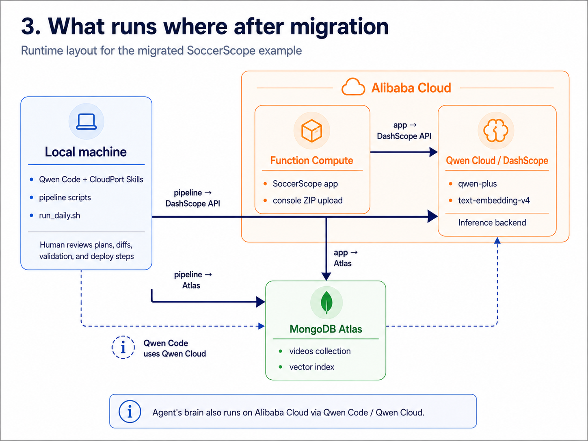

# CloudPort Agent

**Supervised Gemini-to-Qwen Cloud migration agent, packaged as native Qwen Code Agent Skills.**


**Submission track:** Track 4 — Autopilot Agent

CloudPort Agent migrates production Gemini / Google Cloud applications to Qwen on Alibaba Cloud by turning real migration experience into reusable, model-invoked Qwen Code Agent Skills.

---

# Why

Production AI applications are quietly locked in. Gemini, Vertex AI, Google Cloud, OpenAI, or AWS assumptions become embedded in code, configuration, dependencies, deployment scripts, and vector indexes. Migration cost is vendor lock-in. CloudPort Agent attacks that cost directly: it makes an AI stack portable, so teams can stand up a backup site on a second cloud, retain pricing leverage, and reduce single-provider risk.

### Why Gemini → Qwen / Alibaba Cloud first

The porting pattern is general, but the shipped skills currently cover the migration with the clearest demonstrated payoff:

- **Cost at agent-scale context.** Pricing varies by deployment region, deployment scope, request size, caching, batch mode, and temporary promotions. As of **2026-07-20**, the relevant list prices are:

  | Model and scope | Input price per 1M tokens | Output price per 1M tokens |
  |---|---:|---:|
  | `qwen3.7-max`, Japan (Tokyo), Global scope, 0–1M input tokens/request | $1.65 | $4.951 |
  | Gemini 3.1 Pro Standard, prompt ≤200K | $2.00 | $12.00 |
  | Gemini 3.1 Pro Standard, prompt >200K | $4.00 | $18.00 |

  See the current [Alibaba Cloud Model Studio pricing](https://www.alibabacloud.com/help/en/model-studio/model-pricing) and [Gemini API pricing](https://ai.google.dev/gemini-api/docs/pricing) before making a production decision. Temporary discounts are excluded from the comparison below because they change over time.

  There is no universal “55% cheaper” figure. Savings depend on the input/output ratio and on whether each Gemini request crosses 200K tokens:

  | Example workload | Qwen cost | Gemini cost, ≤200K tier | Reduction | Gemini cost, >200K tier | Reduction |
  |---|---:|---:|---:|---:|---:|
  | 1M input + 1M output | $6.601 | $14.00 | 52.9% | $22.00 | 70.0% |
  | 5M input + 1M output | $13.201 | $22.00 | 40.0% | $38.00 | 65.3% |
  | 10M input + 1M output | $21.451 | $32.00 | 33.0% | $58.00 | 63.0% |

  A recent end-to-end CloudPort migration test consumed approximately **5.7 million input tokens in total** across the agent's multi-step run. This cumulative measurement does not imply that every individual request exceeded 200K tokens; actual request-size distribution must be used for an exact cost estimate. It does show why cumulative token cost and long-context pricing matter for modern repository-aware agents. It also demonstrates the excellence of Qwen Code’s token caching system.



- **A world-leading open-weight ecosystem.** The Qwen ecosystem includes publicly released model weights, including Apache-2.0 releases, alongside managed Alibaba Cloud APIs. Qwen3's official materials report leading performance among open-source models in complex agent tasks. Not every managed Qwen API model is identical to an open-weight release, but the ecosystem provides a practical managed-to-self-hosted path that a managed-only model family cannot offer.
- **Business continuity, proven.** The same production application runs on both clouds today: SoccerScope on Gemini / Cloud Run and its migrated twin on Qwen / Alibaba Cloud Function Compute. Repository investigation, migration, test execution, failure repair, and package validation are agent-executed. Risky local operations remain under Qwen Code's safety controls, while billable or production cloud operations remain deliberately human-executed.

Alibaba Cloud is not the default destination for many teams even when its models are competitive, because migration cost blocks the door. These Agent Skills reduce that switching cost: easier to move in, and easier to avoid becoming locked in again.

---

## What it does

Point Qwen Code at a Gemini-based repository and CloudPort Agent runs a supervised autopilot workflow:

1. **Scan automatically** for Gemini call sites across Python, JavaScript / TypeScript, REST calls, configuration, infrastructure files, and deployment scripts while preserving unrelated Google integrations.
2. **Plan automatically** with API mappings, dependency changes, validation criteria, embedding-space safeguards, and deployment impact.
3. **Apply the migration automatically** with minimal code and configuration changes, including multimodal payloads and structured-output compatibility.
4. **Run tests and repair failures automatically**, including schema checks, offline unit tests, syntax checks, package validation, and project-specific smoke checks that do not require production credentials.
5. **Build and validate the Function Compute artifact**, then generate exact human-executed instructions for cloud resource creation and production deployment.

CloudPort Agent is autonomous inside the checked-out repository. Repository investigation, file edits, dependency migration, test execution, failure repair, and deployment-package validation are agent-executed. Qwen Code's approval system remains the local safety layer. In Auto mode, routine read-only operations, in-workspace edits, builds, and tests can proceed automatically, while destructive or otherwise risky commands are blocked or require an explicit operator decision.

The cloud boundary is intentionally narrower. Creating instances or functions, supplying production credentials, rebuilding billable indexes, and deploying to production can change spend or availability. CloudPort Agent prepares and validates the artifacts and commands, but leaves those final operations to the human operator. This is a **supervised autopilot boundary**, not a limitation of the repository-migration workflow.

The reference migration target uses an ADK-based agent layer (`google.adk.agents`). The CloudPort Skills are written around migration patterns, validation rules, and deployment constraints, making them adaptable to other backends that retain a similar agent structure.

---

## What the Migration Actually Touches

CloudPort Agent is not a find-and-replace for API keys. The Gemini → Qwen migration spans four layers:

### 1. LLM swap via Custom Skills

The Google ADK agent core is rewired from Gemini to Qwen (`dashscope/qwen-plus` via LiteLLM) while preserving the surrounding framework.

### 2. RAG re-indexing with Qwen Embeddings

The application runs RAG over MongoDB Atlas Vector Search. Embeddings are migrated from Gemini to Qwen `text-embedding-v4` through the DashScope OpenAI-compatible API. Vectors from different models are not interchangeable, so the corpus is re-embedded and the vector search index regenerated.

### 3. MCP server integration on serverless

The application uses the official MongoDB MCP server. On Cloud Run it ran via `npx`; Function Compute 3.0 Custom Runtime has no Node executable guaranteed on `PATH`, so the invocation is rewritten to a direct `node` call with `node_modules` bundled at build time.

### 4. Structured output compatibility layer

The behavior of `response_schema` differs between providers. The migration therefore combines schema instructions in the prompt, local Pydantic validation, and retries after validation failure.

---

## Architecture

CloudPort Agent is best understood as three diagrams: the migration overview, the reusable skill system, and the post-migration runtime layout.



### 1. Migration overview



CloudPort Agent sits between a **GCP with Gemini** source stack and a **Qwen with Alibaba Cloud** target stack. The supervised migration agent runs inside Qwen Code and autonomously performs repository analysis, migration, testing, repair, and package validation. Qwen Code safety controls govern risky local commands; billable and production deployment actions remain human-executed.

### 2. Skills architecture



The skills are split into reusable core migration skills, a generalizer that creates thin project profiles, and project-specific profiles such as `project-soccerscope`. `system-diagram-generator` is a standalone discovery aid and is not required by the migration execution path.

### 3. What runs where after migration



The migrated SoccerScope example uses local pipeline scripts, Alibaba Cloud Function Compute, Qwen Cloud / DashScope, and MongoDB Atlas Vector Search. The agent's reasoning runtime also uses Qwen Code / Qwen Cloud.

See also: [`docs/SKILLS_ARCHITECTURE.md`](docs/SKILLS_ARCHITECTURE.md)

---

## Skills catalog

| Skill | Role | One-line description |
|---|---|---|
| `gemini-to-qwen-api-mapping` | Core | Maps Gemini SDK, Vertex AI, JavaScript SDK, REST, and provider-config usage to Qwen / DashScope-compatible patterns, including multimodal and structured output. |
| `dependency-migration` | Core | Updates dependency files, lockfiles, import expectations, and environment variables without touching unrelated Google packages. |
| `migration-validation` | Core | Defines equivalence checks, schema checks, vector-index compatibility checks, and smoke-run sign-off gates. |
| `deploy-alibaba-fc-advisor` | Cloud boundary | Builds and validates self-contained Function Compute artifacts, then produces a human-executed deployment checklist. Cloud resource creation and production deployment remain intentionally manual. |
| `project-profile-generator` | Generalizer | Scans an unfamiliar repository across languages and configuration surfaces, writes a thin project profile, and continues the repository migration unless a concrete high-impact ambiguity blocks safe progress. |
| `project-soccerscope` | Project profile | Reference profile encoding SoccerScope-specific paths, ADK structure, constraints, and migration lessons. |
| `system-diagram-generator` | Standalone | Generates a confidentiality-safe architecture report for discovery or handover; it is separate from the Gemini-to-Qwen migration path. |

---

## Quickstart

CloudPort Agent's core product is a set of Qwen Code Agent Skills; a complete runnable migration example is included under [`examples/`](examples/).

### Option 1: Install as project skills

From the root of this repository, copy the contents of `skills/` into the target repository:

```bash
TARGET=/path/to/your-project
mkdir -p "$TARGET/.qwen/skills"
cp -R skills/. "$TARGET/.qwen/skills/"
```

This form is safe to run again: it does not create a nested `.qwen/skills/skills/` directory. To make the target an exact mirror and remove stale CloudPort skills, use `rsync` deliberately:

```bash
rsync -a --delete skills/ "$TARGET/.qwen/skills/"
```

Then restart Qwen Code inside the target repository and run:

```text
/skills
```

### Option 2: Install as personal skills

```bash
mkdir -p ~/.qwen/skills
cp -R skills/. ~/.qwen/skills/
```

Then restart Qwen Code in any project and run `/skills`.

### Recommended Qwen Code safety mode

For long autonomous migration sessions with guardrails on destructive shell commands and outbound network calls:

```text
/approval-mode auto
```

Qwen Code evaluates shell commands and blocks risky operations while allowing routine repository work to continue. Do not use YOLO mode for an unfamiliar production repository.

### Demo prompt

The full prompt is also available at [`docs/demo-prompt.md`](docs/demo-prompt.md).

```text
You are Qwen Code working inside a repository that contains a Gemini / Google Cloud AI application.

Use the CloudPort Agent skills to complete a supervised Gemini-to-Qwen Cloud migration.

Goals:
1. Scan the repository across source code, dependency manifests, configuration, infrastructure, CI, and deployment scripts. Identify Gemini SDK, Vertex AI, REST, embeddings, multimodal calls, structured output, environment variables, ADK structure, and deployment assumptions.
2. Create a migration plan as a reviewable artifact, then continue the repository migration automatically. Do not wait for separate plan or per-diff approval.
3. Convert Gemini calls to Qwen / DashScope-compatible calls, using the OpenAI-compatible API where appropriate.
4. Convert embedding usage while preserving dimensions and vector-index compatibility. Never mix embedding vector spaces.
5. Replace provider-specific structured-output behavior with prompt schema instructions, local validation, and retries where needed.
6. Update canonical dependency files and regenerated lockfiles carefully. Preserve unrelated Google packages.
7. Run offline tests, syntax checks, package validation, and project-specific smoke checks. Diagnose and repair failures until checks pass or a concrete external blocker is identified.
8. Build and validate a self-contained Alibaba Cloud Function Compute artifact and provide exact deployment instructions.

Safety boundary:
- Use Qwen Code approval and permission controls for commands classified as risky or destructive.
- Routine repository analysis, edits, builds, tests, and repairs should proceed automatically in the selected safe approval mode.
- Do not create cloud resources, use production credentials, rebuild billable indexes, or deploy to production. Prepare the commands and leave these spend- or availability-changing operations to the human operator.

Start by scanning the repository, then complete the repository migration and validation workflow.
```

### Expected flow

1. Qwen Code detects the relevant CloudPort skills.
2. The agent scans all relevant repository surfaces and writes the project profile and migration plan.
3. The agent applies minimal code, dependency, configuration, and deployment-package changes.
4. The agent runs tests, diagnoses failures, and repairs the migration automatically.
5. The agent builds and inspects the Function Compute upload artifact.
6. The agent reports changed files, test evidence, remaining external checks, and exact deployment commands.
7. Qwen Code blocks or requests a decision when its safety policy classifies a local operation as risky.
8. The human executes credential-scoped, billable, or production cloud operations.

---

## Real-world result: SoccerScope

CloudPort Agent is based on a real migration, not a toy example. SoccerScope is a production YouTube analytics and multilingual comment-analysis pipeline originally built on Gemini and Google Cloud and migrated to Qwen / DashScope and Alibaba Cloud Function Compute.

### Evidence in this repository

| Evidence | Link |
|---|---|
| Complete runnable migration example | [`examples/gemini-streamlit-cloudrun-to-qwen-fc/`](examples/gemini-streamlit-cloudrun-to-qwen-fc/) |
| Qwen / Alibaba Cloud Model Studio API compatibility layer | [`cloudport_compat.py`](examples/gemini-streamlit-cloudrun-to-qwen-fc/cloudport_compat.py) |
| Migrated Streamlit application | [`app.py`](examples/gemini-streamlit-cloudrun-to-qwen-fc/app.py) |
| Function Compute-compatible ZIP package builder | [`deploy.sh`](examples/gemini-streamlit-cloudrun-to-qwen-fc/deploy.sh) |
| Offline request-mapping and safety tests | [`tests/test_cloudport_compat.py`](examples/gemini-streamlit-cloudrun-to-qwen-fc/tests/test_cloudport_compat.py) |
| Live text / image / video checks | [`smoke_test.py`](examples/gemini-streamlit-cloudrun-to-qwen-fc/smoke_test.py) |
| Build and verification instructions | [`example README`](examples/gemini-streamlit-cloudrun-to-qwen-fc/README.md) |

No Serverless Devs `s.yaml` is required for this evidence. The repository shows the Alibaba Model Studio API integration and the Function Compute artifact-building path directly.

### Production evidence

| Evidence | Link |
|---|---|
| Original Gemini repository | https://github.com/webbigdata-jp/soccerscope |
| Original Gemini web app | https://soccer.tubesaku.com/ |
| Migrated Qwen repository | https://github.com/webbigdata-jp/qwen-soccerscope |
| Migrated Qwen web app | https://qwen-soccer.tubesaku.com/ |
| Migrated Gemini Official Sample to Qwen | https://qwenstremlint.tubesaku.com/ |
| Qwen embedding API usage | https://github.com/webbigdata-jp/qwen-soccerscope/blob/main/pipeline/1_embed_videos.py#L109 |
| Qwen analysis API usage | https://github.com/webbigdata-jp/qwen-soccerscope/blob/main/pipeline/3_analyze_comments.py#L177 |
| Alibaba Cloud deployment script | https://github.com/webbigdata-jp/qwen-soccerscope/blob/main/app/deploy.sh#L25 |
| Demo video | [CloudPort Agent](https://youtu.be/Q7YraU36X0Q) |
| Evidence video | [Proof that it is running on Alibaba Cloud](https://youtu.be/zrU0wAVNn0Q) |
| Project blog | [AI Agent Skills migrating a World Cup RAG app](https://dev.to/dahara1/ai-agent-skills-migrating-worldcup-rag-appgemini-and-gcp-to-qwen-and-alibaba-5dmg) |

Demo measurement from the recorded migration run:

| Metric | Result |
|---|---:|
| End-to-end demo time | About 5 minutes |
| Qwen Code safety approvals | 8 |
| Human-written code changes | 0 |
| Files changed by the agent | 2 |

A separate recent migration test consumed approximately **5.7M input tokens** in total.

The migrated application uses:

- **Alibaba Cloud Function Compute** for the SoccerScope web application deployment.
- **Qwen Cloud / DashScope** as the inference backend: `qwen-plus` for analysis and `text-embedding-v4` for retrieval embeddings.
- **MongoDB Atlas Vector Search** for stored videos and vector retrieval.
- **Local pipeline scripts** for data ingestion, embedding, and scheduled jobs.
- **ADK agent structure** (`google.adk.agents`) in the agent layer, which gives CloudPort a practical path to support other ADK-based model backends later.

---

## Autonomy and safety boundary

CloudPort Agent is a **supervised repository-migration operator**, not merely a deployment advisor.

Inside the checked-out repository, it performs discovery, migration planning, code and dependency changes, structured-output adaptation, embedding compatibility checks, test execution, failure repair, and Function Compute package validation. Safe automation is delegated to Qwen Code's approval modes, so normal edits, builds, and tests can proceed without disabling platform safety controls.

Potentially destructive local operations remain governed by Qwen Code's permission system. Credential-scoped or billing-scoped cloud operations remain outside the agent's authority by design. The agent prepares the artifact and exact commands; the human deliberately creates cloud resources, supplies production credentials, triggers production deployment, or starts a billable vector-index rebuild.

This boundary preserves end-to-end automation for the migration itself while preventing an application-porting task from silently changing production infrastructure or cloud spend.

---

## Repository layout

```text
cloudport-agent/
├── skills/                              # Canonical Qwen Code Skills
│   ├── gemini-to-qwen-api-mapping/
│   ├── dependency-migration/
│   ├── migration-validation/
│   ├── project-profile-generator/
│   ├── deploy-alibaba-fc-advisor/
│   └── project-soccerscope/
├── .qwen/skills/                        # Mirrored project-local Skills
├── examples/
│   ├── gemini-streamlit-cloudrun-to-qwen-fc/
│   │   ├── app.py
│   │   ├── cloudport_compat.py
│   │   ├── deploy.sh
│   │   ├── smoke_test.py
│   │   └── tests/
│   └── system-diagram-generator-output/
├── docs/
│   ├── architecture_1_migration_overview.png
│   ├── architecture_2_skills_architecture.png
│   ├── architecture_3_runtime_layout.png
│   ├── model_token_usage.png
│   ├── SKILLS_ARCHITECTURE.md
│   └── demo-prompt.md
├── .github/workflows/validate.yml
├── README.md
└── LICENSE
```

Files under `skills/` are canonical. The corresponding files under `.qwen/skills/` must remain identical; CI verifies the mirror.

---

## Built with

Qwen Code, Qwen Cloud, `qwen-plus`, `text-embedding-v4`, DashScope OpenAI-compatible API, Alibaba Cloud Function Compute, Python, OpenAI SDK, Pydantic, MongoDB Atlas Vector Search, Google ADK (`google.adk.agents`), uv, MCP, and Qwen Code Agent Skills.

---

## License

This project is released under the Apache License 2. See [`LICENSE`](LICENSE).
